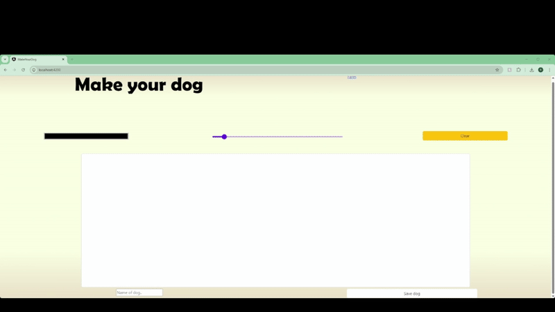

# Make your dog

A fun little project I made in the 2023 summer to learn Angular and play around with custom canvas animations. It implements a basic version of paint to use for drawing.

# Requires:
  - Node.js : https://nodejs.org/en/download
  - AngularCLI : `npm install -g @angular/cli` (or refer to https://angular.dev/installation#install-angular-cli for more options) 

# Usage:
  - After cloning the repository run `npm install` followed by `ng serve` in the Angular workspace (i.e. `./make-your-dog/make-your-dog/`)
